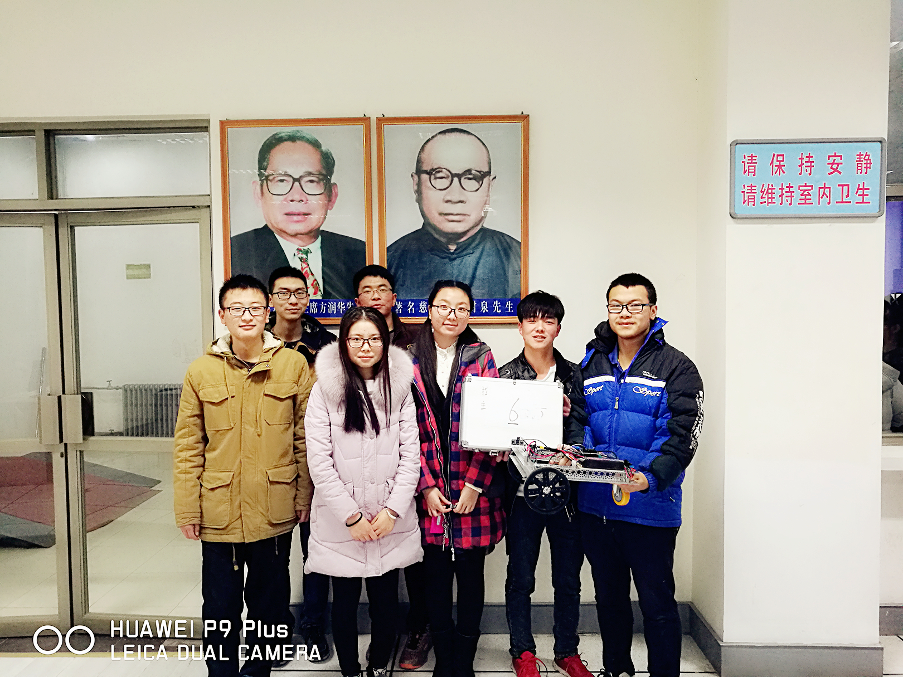

1. [项目报告](https://github.com/kinggolzu/Introduction-to-Computer/blob/master/content/production/2016/group6/report.docx?raw=true)
2. [项目介绍PPT](https://github.com/kinggolzu/Introduction-to-Computer/blob/master/content/production/2016/group6/slide.ppt?raw=true)
3. [程序源代码](https://github.com/kinggolzu/Introduction-to-Computer/blob/master/content/production/2016/group6/source.xml?raw=true)
3. 成果展示视频
	
	<iframe frameborder="0" width="640" height="498" src="https://v.qq.com/iframe/player.html?vid=q03622k0o2n&tiny=0&auto=0" allowfullscreen></iframe>
	
4. 团队及成果照片

	